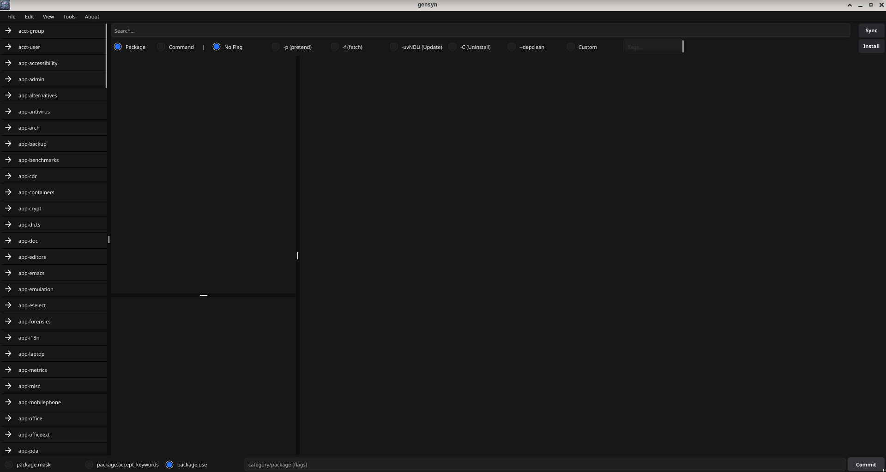
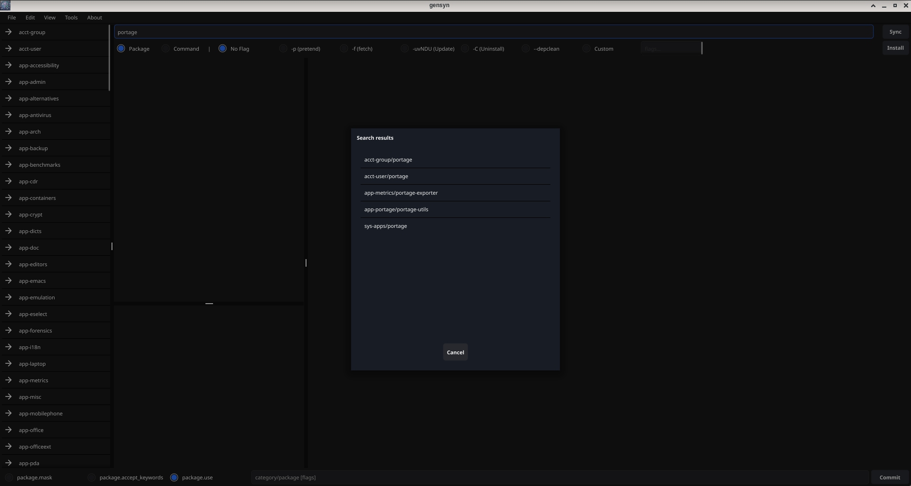
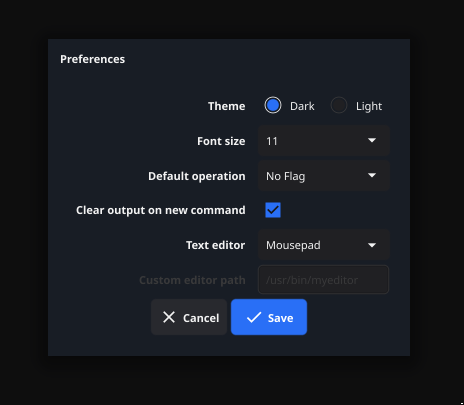
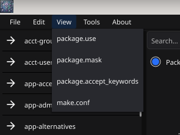
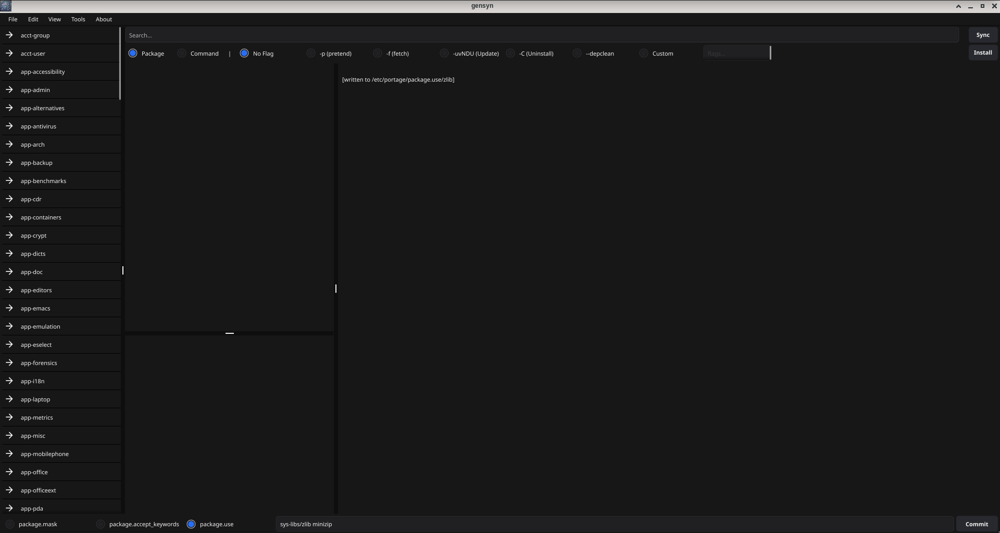

# gensyn

A Synaptic-like graphical package manager for Gentoo Linux, built with Go and the [Fyne](https://fyne.io) toolkit.



---

## Features

- Browse the full Gentoo package tree organized by category
- Installed packages marked with **✓** and bold text in the tree
- Package details panel showing installed version and ebuild files
- Package description parsed directly from the ebuild
- Package and command-based search (via `equery belongs`)
- Run `emerge` operations with a single click:
  - Install, Pretend, Fetch, World Update, Uninstall, Depclean, Custom flags
- Sync the Gentoo repository via `emerge --sync`
- Write entries to `package.use`, `package.mask`, and `package.accept_keywords` — each entry written to a per-package file
- View and edit portage config files from the View menu (`package.use`, `package.mask`, `package.accept_keywords`, `make.conf`)
- Run `emerge --info` from the Tools menu
- Persistent preferences: dark/light theme, font size, default operation, output behavior, and preferred text editor
- sudo password dialog with Enter key support for all privileged operations

---

## Screenshots

| Main Window | Search Results |
|---|---|
|  |  |

| Preferences | View Menu |
|---|---|
|  |  |

| Bottom Toolbar |
|---|
|  |

---

## Requirements

- Gentoo Linux
- Go 1.21 or later
- `app-admin/sudo` — required for all privileged operations
- `app-portage/gentoolkit` — required for Command search mode (`equery belongs`)

### Fyne system dependencies

```bash
emerge -a x11-libs/libX11 x11-libs/libXcursor x11-libs/libXrandr \
          x11-libs/libXinerama media-libs/mesa
```

---

## Installation

### Run directly

```bash
git clone https://github.com/Brainbeer/gensyn.git
cd gensyn
LANG=en_US.UTF-8 go run main.go
```

### Build and install

```bash
git clone https://github.com/Brainbeer/gensyn.git
cd gensyn
go build -o gensyn .
sudo cp gensyn /usr/local/bin/
```

---

## Usage

### Browsing packages

Expand a category in the left tree to see its packages. Packages already installed on your system are shown with a **✓** prefix in bold. Clicking a package shows its ebuild files and description in the center panel.

### Installing a package

1. Select a package in the tree
2. Choose an operation from the radio buttons (`No Flag`, `-p (pretend)`, `-f (fetch)`, `-uvNDU (Update)`, `-C (Uninstall)`, `--depclean`, or `Custom`)
3. Click **Install**
4. Enter your sudo password when prompted

### Syncing the repository

Click **Sync** to run `emerge --sync`. A sudo password will be required.

### Searching

Type in the search box and press Enter. Two modes are available:

- **Package** — searches package names across all categories; a single match navigates directly, multiple matches show a list dialog
- **Command** — uses `equery belongs` to find which package owns a given file or command (requires `app-portage/gentoolkit`)


### Writing portage config entries

Use the bottom toolbar to append entries to your portage config files:

1. Select the target directory (`package.mask`, `package.accept_keywords`, or `package.use`)
2. Type the entry — e.g. `sys-libs/zlib minizip` for package.use, or `sys-libs/zlib ~amd64` for accept_keywords
3. Click **Commit** and enter your sudo password

The entry is written to a file named after the package inside the selected directory. For example `sys-libs/zlib minizip` writes to `/etc/portage/package.use/zlib`.


### Viewing and editing portage config files

Use the **View** menu to browse files in `package.use`, `package.mask`, `package.accept_keywords`, or open `make.conf` directly. Selecting a file offers a **View** or **Edit** option. Editing opens the file in your configured text editor with sudo.


### emerge --info

**Tools → emerge --info** runs `emerge --info` and displays the output in a dialog. Useful for checking your current profile, CFLAGS, and Portage configuration when reporting bugs or troubleshooting.

---

## Preferences

Access via **Edit → Preferences**.

| Setting | Description |
|---|---|
| Theme | Dark or Light |
| Font size | 9–14pt |
| Default operation | Which emerge flag is pre-selected on launch |
| Clear output on new command | Clears the terminal panel before each new operation |
| Text editor | Editor used when editing portage config files (Mousepad, Pluma, Kwrite, Kate, Gedit, Geany, Xed, Featherpad, Sublime Text, VSCode, Atom, or Custom) |
| Custom editor path | Full path to a custom editor executable |


Preferences are saved to `~/.config/gensyn/prefs.json`.

---

## License

This project is licensed under the GNU General Public License v3.0. See the [LICENSE](LICENSE) file for details.

---

## Author

Jarrod McCandless
https://github.com/Brainbeer/gensyn